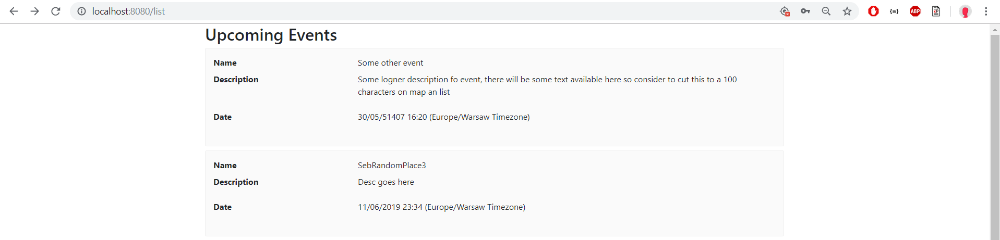
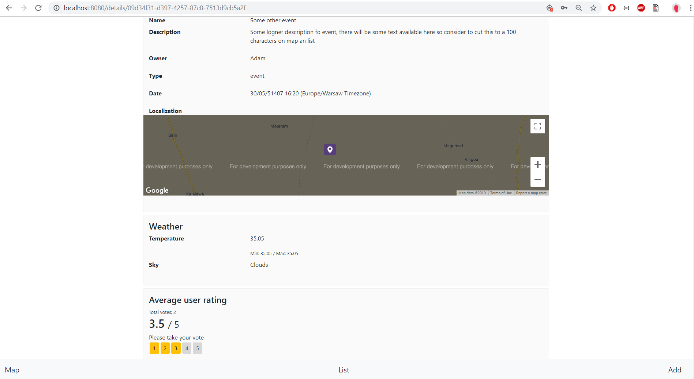
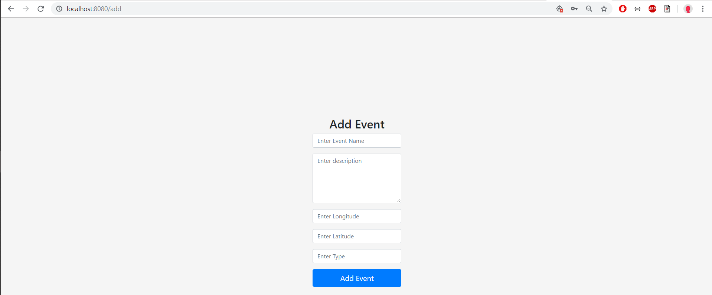

<h1>Informator ciekawych miejsc</h1>

<h2>Charakterystyka projektu</h2>
Firebase Cloud Functions - API  
Firebase Firestore - baza danych  

Wykorzystane technologie:  
backend - ExpressJS, PassportJS, JWT Tokens  
frontend - ReactJS + Redux + Webpack + Cordova  
API - Open Weather 

<h2>Skład zespołu projektowego</h2>
Wojciech Matusiak  
Adam Oramus   
Sebastian Nowak  
Joanna Szymanek 

<h2>Cel aplikacji</h2>
Aplikacja dedykowana jest osobom, które chciałyby wiedzieć, co się dzieje w ich najbliższym i dalszym otoczeniu lub co warto zwiedzić. Swoją funkcjonalność oferuje tylko zalogowanym użytkownikom. Umożliwia przeglądanie obiektów i eventów na mapie oraz na liście. Przy opisie eventu użytkownik widzi prognozę pogody przewidzianą na dzień tego wydarzenia. Dane pogodowe wyciągane są z Open Weather API.

 
Diagram przypadków użycia:

 
Widok ekranu logowania

 
Widok eventu na mapie

 
Widok eventów na liście

 
Widok detali eventu

 
Widok formularza dodawania eventu

<h2>Linki do składowych projketu</h2>
<a href="https://bai-1212.web.app/">Aplikacja webowa</a>   
<a href="http://seba.linuxpl.com/?fbclid=IwAR0EELeKn_AIUj2pHTYEiZ-nYCL6haFm-cXdq3Wh8f4yc9BMqksjNSEC_1k">Prototyp aplikacji Mockplus</a>   
<a href="https://trello.com/b/Q0zHirLT/informator-ciekawych-miejsc">Zarządzanie projektem Trello</a>  
<a href="https://github.com/Cenarius1/BaiCiekaweMiejsca">Repozytorium Git</a>  

